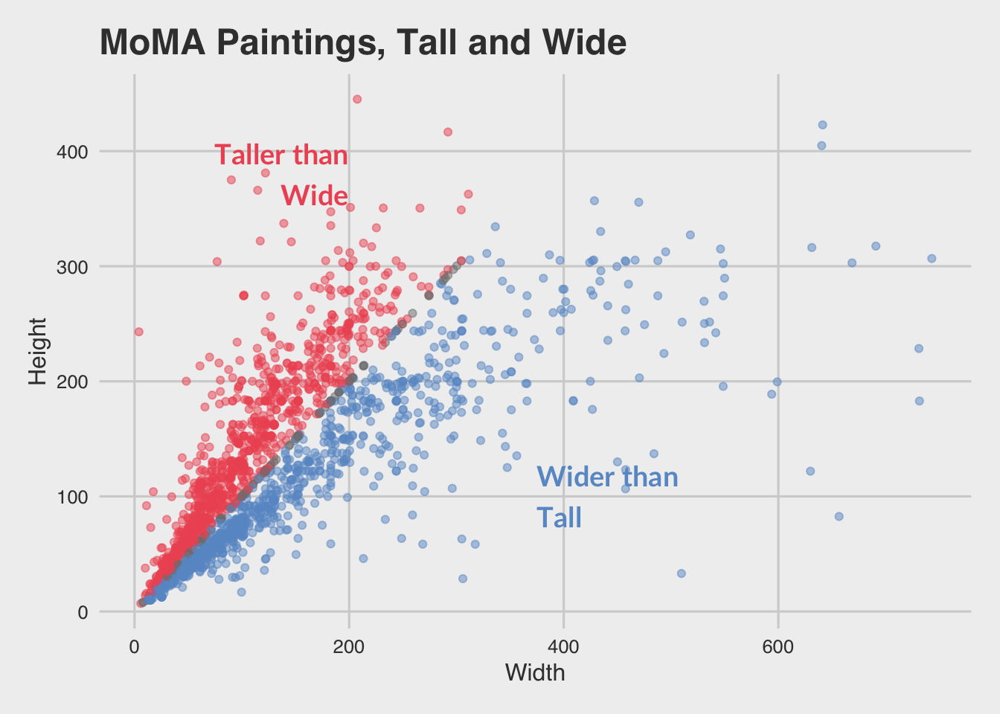

# MoMA Museum Tour 

We’ll use data from the Museum of Modern Art (MoMA), publicly available on GitHub and as analyzed by [fivethirtyeight.com](https://fivethirtyeight.com/features/a-nerds-guide-to-the-2229-paintings-at-moma/).

```{r}
library(readr)
moma <- read_csv("http://bit.ly/cs631-moma")
```


We'll be making this plot!


