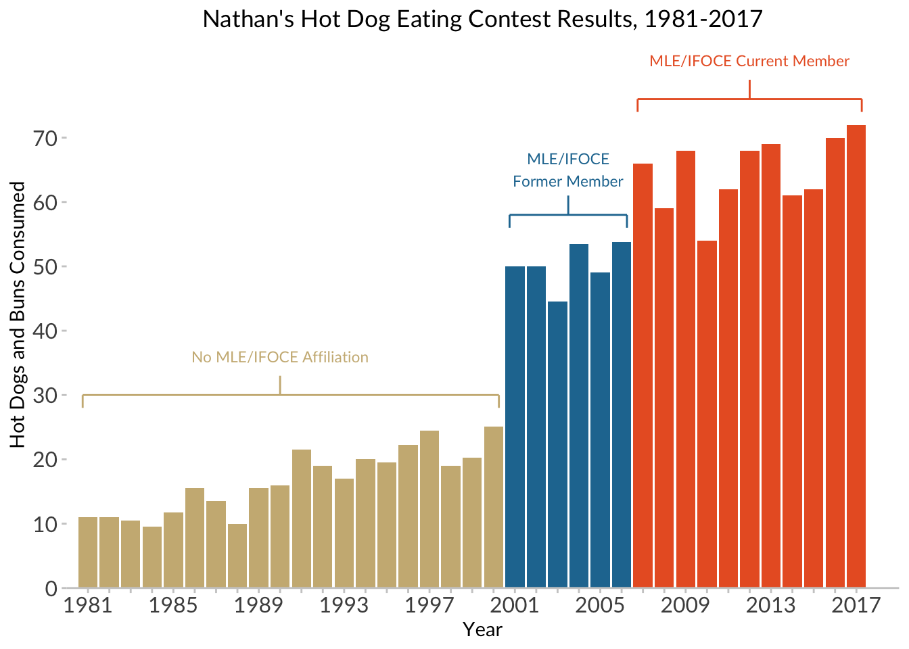

# Nathan’s Hot-Dog Eating Contest 

This includes a reconstruction of Nathan Yau’s hot dog contest example, as interpreted by Jackie Wirz, ported into R and ggplot2 by Steven Bedrick for a workshop for the OHSU Data Science Institute, and finally adapted by Alison Hill for all you intrepid Data-Viz-onauts!


```r
library(tidyverse)
```

```
## ── Attaching packages ─────────────── tidyverse 1.3.0 ──
```

```
## ✓ ggplot2 3.3.0.9000     ✓ purrr   0.3.3     
## ✓ tibble  2.1.3          ✓ dplyr   0.8.5     
## ✓ tidyr   1.0.2          ✓ stringr 1.4.0     
## ✓ readr   1.3.1          ✓ forcats 0.4.0
```

```
## ── Conflicts ────────────────── tidyverse_conflicts() ──
## x dplyr::filter() masks stats::filter()
## x dplyr::lag()    masks stats::lag()
```

```r
hot_dogs <- read_csv("http://bit.ly/cs631-hotdog", 
    col_types = cols(
      gender = col_factor(levels = NULL)
    ))
```

We'll be making this plot!


