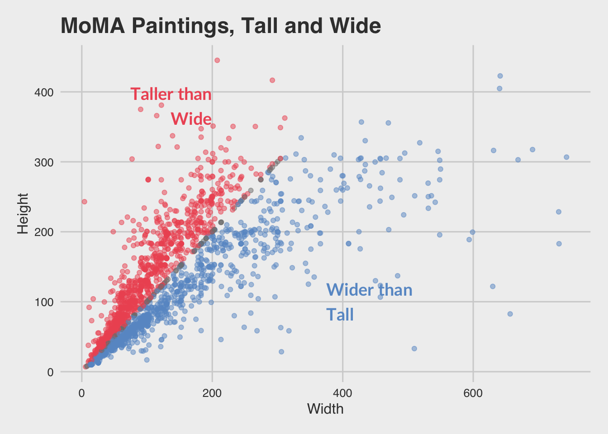

# MoMA Museum Tour 

We’ll use data from the Museum of Modern Art (MoMA), publicly available on GitHub and as analyzed by [fivethirtyeight.com](https://fivethirtyeight.com/features/a-nerds-guide-to-the-2229-paintings-at-moma/).


```r
library(readr)
moma <- read_csv("http://bit.ly/cs631-moma")
```

```
## Parsed with column specification:
## cols(
##   .default = col_double(),
##   title = col_character(),
##   artist = col_character(),
##   artist_bio = col_character(),
##   artist_gender = col_character(),
##   circumference_cm = col_logical(),
##   diameter_cm = col_logical(),
##   length_cm = col_logical(),
##   seat_height_cm = col_logical(),
##   purchase = col_logical(),
##   gift = col_logical(),
##   exchange = col_logical(),
##   classification = col_character(),
##   department = col_character()
## )
```

```
## See spec(...) for full column specifications.
```


We'll be making this plot!


